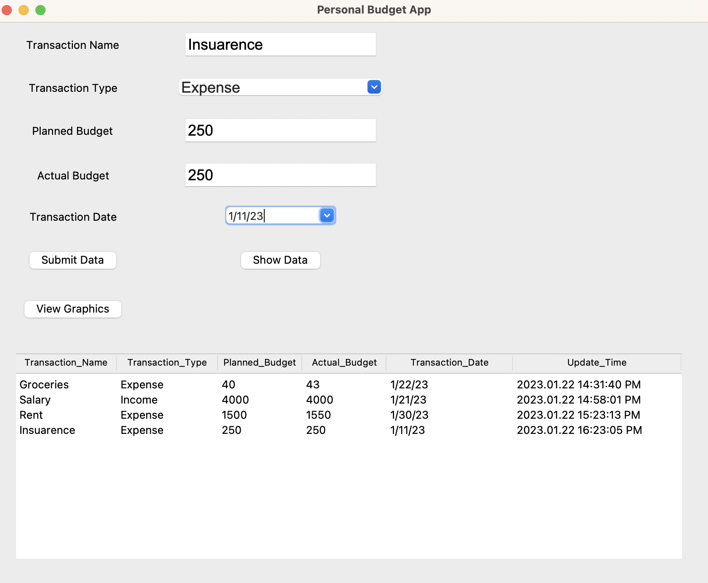
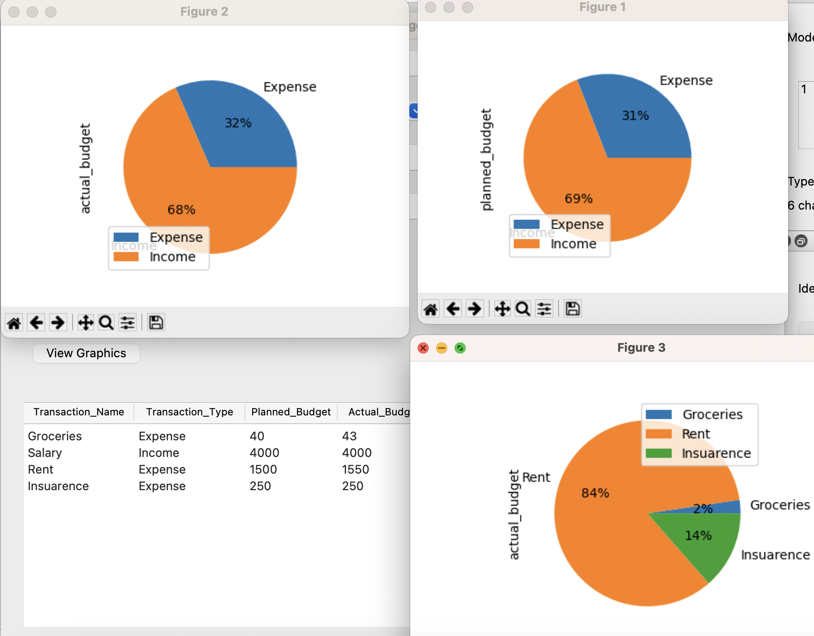

# Personal Budgeting

The goal of this project is to create a personal budgeting app that allows users to track their income and expenses, and view their spending habits.

## Description

User can enter income and expense detail on user interface. This information will be stored on database. This project also allows user to view previous entries and to visualize the user's budget data. 





## Getting Started

### Dependencies

* You can find all the libraries and version information used on this project in requirements.txt.
* It is required Python 3.10.9 or greater versions.

### Installing

* The following command will install the packages according to the configuration file
* $ pip3 install -r requirements.txt

### Executing program

* First I created a database to store user’s budget data. model.py file includes sql queries in order to create a table,
  insert data to table and query user’s entries. "create_connection" function helps to connect sqlite database and 
  "create_table" function uses sql_create_budget_table query in order to initialize database. For this project we created
  just one table which is budget table. But If we need to create more table we can add sql queries for these tables, 
  and it is too easy adding new tables.

```
  def initialize_db():
    """ initialize db"""
      conn = create_connection(filename)
      if conn is not None:
          create_table(conn, sql_create_budget_table) 
          ** 
          create_table(conn, sql_create_table2)
          create_table(conn, sql_create_table3)
          …… 
          **
      else:
          print("Error! cannot create the database connection.")
```

* After complete the database part, we should create our gui with the help of the Tkinter module. MyGUI class has a constructor
  __init__ function and this function will create the user interface. With the below code, I created the main window for the app
  (root window) and determine size and title for it.  

```
  def __init__(self):
      self.root = Tk()
      self.root.title('Personal Budget App')
      self.root.geometry("900x800")

```

* For tracking user expenses and incomes we need to retrieve the user data, and we need Entry widgets in our ui. Below code
  an example for Transaction Name. User can enter the name of transaction. It can be rent, salary, groceries etc. Entry 
  widgets also contains a label. In the below code, first and third lines show the widget if it is label or entry. We 
  should pass the parent widget for each child widget. In this case our parent widget is __self.root__ and our child widgets
  label1 and transaction. The grid() method is used to specify the relative layout (position) of the labels end entries 
  within their root widget. We can think it is a table, and it contains two columns and rows, widgets will be placed 
  according to this layout.

```
      self.label1 = Label(self.root, text='Transaction Name')
      self.label1.grid(row=0, column=0, padx=10, pady=10)

      self.transaction = Entry(self.root, font=('Arial', 18))
      self.transaction.grid(row=0, column=1, padx=10, pady=10)

```

* I created  Planned Budget and Actual Budget  entries and labels by using same logic. For the Transaction Type I used 
 ttk module combobox widget because type section includes two choices: "Income" and  "Expense" .

```
     self.type = ttk.Combobox(self.root, font=('Arial', 18), values=["Income", "Expense"])
     self.type.grid(row=1, column=1, padx=10, pady=10)
```

* For the transaction date, it can be on the date your salary payment or rent payment, I used a different widget it is 
  called as date Entry widget. User can pick a day from calendar for the date of the expenditure.

```
    self.date = tkcalendar.DateEntry(self.root, selectmode='day')
    self.date.grid(row=4, column=1, padx=10, pady=10)

```

* After user enter all needed information, I made a data table for showing all the expenditures, incomes etc. User also 
  can check previous entrances without submitting any data by clicking Show Data button. Data table includes ‘transaction_name',
  'transaction_type', 'planned_budget', 'actual_budget', 'transaction_date', 'update_time’ fields. For all these fields we
  retrieved data from user except **update_time**. For update_time I used **datetime library**, and it shows when user submit
  these data.

```
   #  data table
     header = ['transaction_name', 'transaction_type', 'planned_budget', 'actual_budget', 'transaction_date',
                  'update_time']
     self.table = ttk.Treeview(self.root, columns=header, show='headings', height=12)
     self.table.column('transaction_name', width=120)
     self.table.column('transaction_type', width=120)
     self.table.column('planned_budget', width=100)
     self.table.column('actual_budget', width=100)
     self.table.column('transaction_date', width=150)
     self.table.column('update_time', width=200)
   # column heading
     for c in header:
         self.table.heading(c, text=c.title())
     self.table.grid(row=7, column=0, padx=25, pady=25, columnspan=10)
     
```

* UI consist of three different buttons. Text parts show buttons' names and command parts are the actions triggered when 
  the user clicks buttons.

  ``` 
     self.submit = Button(self.root, text='Submit Data', command=self.submit_data) 
     self.submit.grid(row=5, column=0, padx=10, pady=15)
     
     self.submit = Button(self.root, text='Show Data', command=self.show_data)
     self.submit.grid(row=5, column=1, padx=10, pady=15)
  
     self.view = Button(self.root, text='View Graphics', command=self.show_chart)
     self.view.grid(row=6, column=0, padx=10, pady=15)
  
  ```

* The mainloop() method puts every item on the display and responds to user input until the program terminates.

  ```
      self.root.mainloop()
  ```
  
* When user clicks Submit Data button, submit_data function is triggered. I imported model.py file in order to use its 
  database functions. Steps are for this function:

      1. Create connection
      2. Get current time and format
      3. Execute insert data sql query
  ```
      def submit_data(self):
      # insert data to db
          con = model.create_connection(model.filename)
          now = datetime.now()
          timestamp = now.strftime('%Y.%m.%d %H:%M:%S %p')
          con.cursor().execute(model.sql_insert_data,
                              (self.transaction.get(), self.type.get(), self.planned_bud.get(), self.actual_bud.get(),
                              self.date.get(), timestamp))
  
  ```

  * Second function provides viewing all user inputs as a data table.
    Steps are for this function: 

         1. Create connection 
         2. Execute sql query for getting budget data 
         3. Insert budget data to ttk table

    ```
        def show_data(self):
        # show data on GUI
            con = model.create_connection(model.filename)
             cur = con.cursor()
             cur.execute(model.sql_select_table_data)
             rows = cur.fetchall()
             self.table.delete(*self.table.get_children())
             for i in rows:
                 self.table.insert('', 'end', values=(i[0],
                                   i[1], i[2], i[3], i[4], i[5]))
        
  
    ```

  * For the last function I aimed to plot some graphics by using pandas library and visualize  user’s expenses. I used 
    pandas pie charts for visualize and used matplotlib.pyplot library for plotting these graphs. For the first pie chart
    user can see total expense and income percentage according to planned budget. For the second pie chart user can see 
    total expense and income percentage according to actual budget. Actual budget means how much money user actually 
    spend and planned budget means how much money user intended to spend. The last pie chart shows only expense data and
    user can understand distribution of expenditures.

    ```
       def show_chart(self):
           con = model.create_connection(model.filename)
           df = pd.read_sql_query(model.sql_select_table_data, con)
           df.groupby(['transaction_type']).sum().plot(kind='pie', y='planned_budget', autopct='%1.0f%%')
           df.groupby(['transaction_type']).sum().plot(kind='pie', y='actual_budget', autopct='%1.0f%%')
           ex = df.groupby(['transaction_type']).get_group('Expense')
           ex.plot(kind='pie', y='actual_budget', labels=ex['transaction_name'], autopct='%1.0f%%')
           plt.show()
        
    ```


